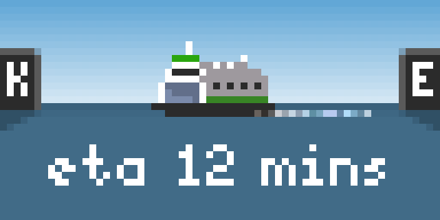

# ferry-tidbyt

Display WSDOT ferry status in relation to the Kingston (WA) terminal on a Tidbyt device.



### One-time setup

1. Install Node.JS 18
2. Install git
3. Clone this repo
4. CD to the repo folder
5. Run `npm install`
6. Create a local `env.json` in the repo root. It will be git-ignored. See the **Secrets** section for more info on this file.

### Secrets

This project assumes an AWS Secrets Manager instance is available. If you don't have or want one, rework `env.ts` to exclude it and put the required config in `env.json`. Here's a complete list:

* `AWS_SECRETS_MANAGER_REGION`
* `AWS_ENV_SECRET_NAME`
* `AWS_ACCESS_KEY_ID`
* `AWS_ACCESS_KEY_SECRET`

    If you're using AWS Secrets Manager, include the above in your `env.json` and store the rest in AWS.

* `VESSELWATCH_APIKEY`

    API key for accessing the WA State Ferries REST API.

    https://www.wsdot.wa.gov/ferries/api/vessels/documentation/rest.html

* `PORT`

    The port the server should listen on. If not specified, defaults to 8082.

    In production, this is set to 3000.

* `TIDBYT_DEVICE_ID`

    Your Tidbyt device ID. Get this from your Tidbyt mobile app.

* `TIDBYT_APIKEY`

    Your Tidbyt API Key. Get this from your Tidbyt mobile app.

#### Example env.json

```json
{
    "AWS_SECRETS_MANAGER_REGION": "...",
    "AWS_ENV_SECRET_NAME": "...",
    "AWS_ACCESS_KEY_ID": "...",
    "AWS_ACCESS_KEY_SECRET": "..."
    ... if you're not using AWS Secrets Manager, exclude the above and add additional entries here, otherwise put the rest in AWS-SM in this JSON format  ...
}
```

### Developing

* I use VS Code as my editor.

### Deploying

* Service is deployed via GitHub Action to an AWS instance.

### Hosting

I host this service on an AWS t2.micro EC2 instance, available in Amazon's free tier.

The instance has much custom configuration, which I will briefly outline here. If you are attempting to set up your own instance, ping me in an issue and I'll try to fill in the gaps.

* OS: Ubuntu 22.04
* The instance is behind an Application Load Balancer, where TLS is terminated
* NodeJS 18 installed
* nginx installed and operating as a reverse proxy
* [pixlet](https://tidbyt.dev/docs/build/installing-pixlet) installed
* Node process managed by [pm2](https://pm2.keymetrics.io/docs/usage/quick-start/)
* Timezone set to America/Los_Angeles (important when inspecting the ferry schedule for the current sailing)
* Probably more things I missed

#### nginx reverse proxy config

```
server {
    listen 80;
    server_name ferry-tidbyt.humanappliance.io;

    location / {
        proxy_pass         http://localhost:3000;

        proxy_http_version  1.1;
        proxy_cache_bypass  $http_upgrade;

        proxy_set_header Upgrade           $http_upgrade;
        proxy_set_header Connection        "upgrade";
        proxy_set_header Host              $host;
        proxy_set_header X-Real-IP         $remote_addr;
        proxy_set_header X-Forwarded-For   $proxy_add_x_forwarded_for;
        proxy_set_header X-Forwarded-Proto $scheme;
        proxy_set_header X-Forwarded-Host  $host;
        proxy_set_header X-Forwarded-Port  $server_port;
    }
}
```

### Misc

#### Inclusion of built files

While this is a TypeScript project, the compiled JavaScript is included because a t2.micro doesn't have enough memory to compile the project.
